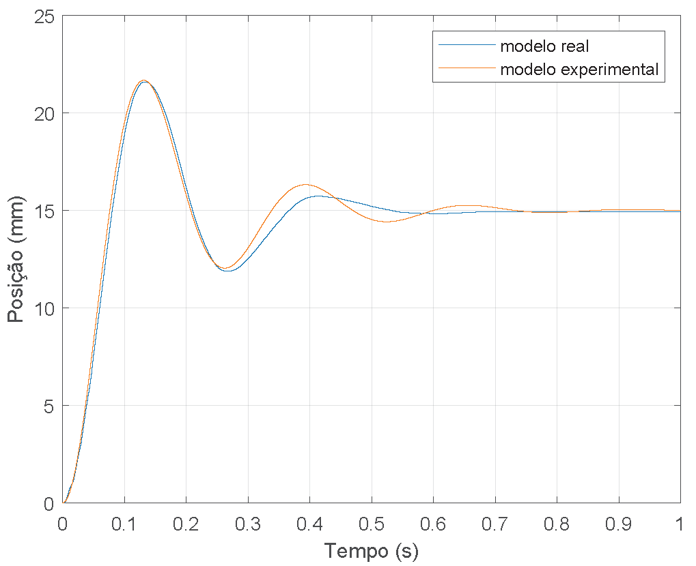
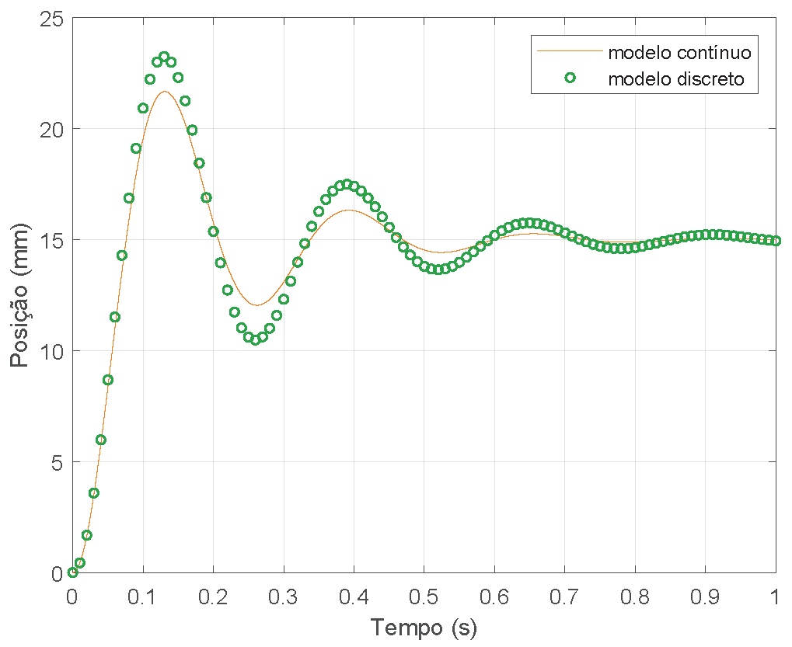
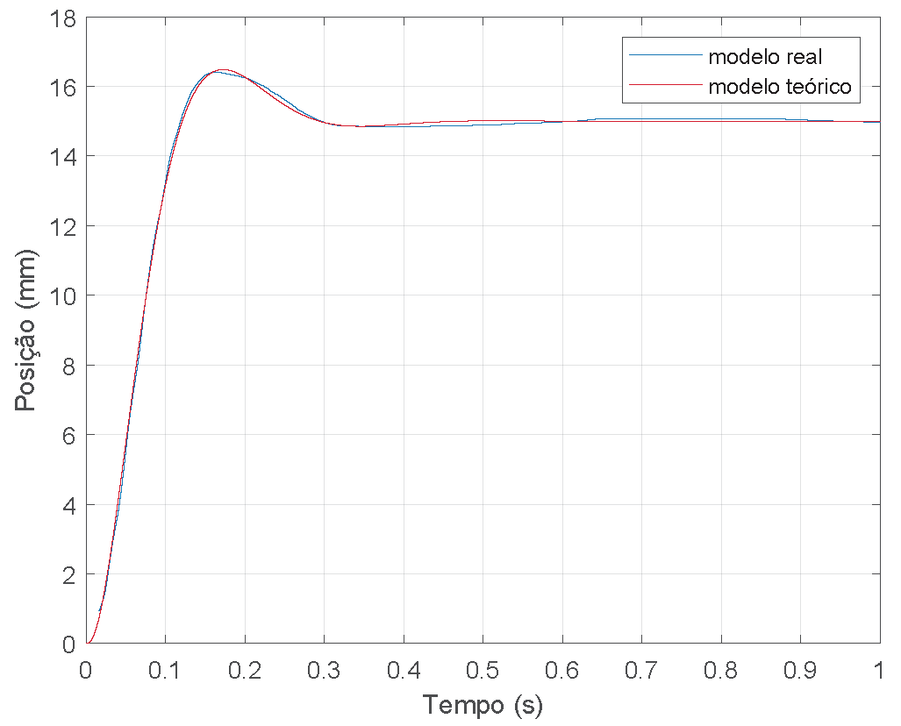
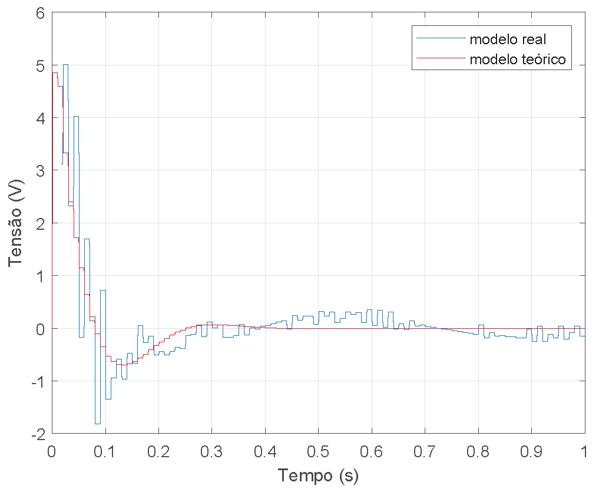

# CD-2022-2_Servomechanism-Control

Este repositório corresponde ao projeto de laboratório da disciplina Controle Digital da Universidade de Brasília e implementa um **controlador PI no espaço de estados** com um observador de ordem mínima para controle de posição de um servomecanismo translacional.

## Configuração

- Versão do Matlab: 2018a

## Resultados

### Projeto

|  **Caracterização do sistema** |  **Discretização da planta**  |
|:------------------------------:|:-----------------------------:|
|  |  |

### Resposta ao degrau

|     **Resposta ao degrau**    |      **Ação de controle**     |
|:-----------------------------:|:-----------------------------:|
|  |  |